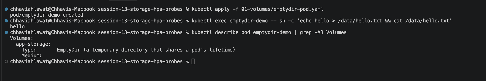
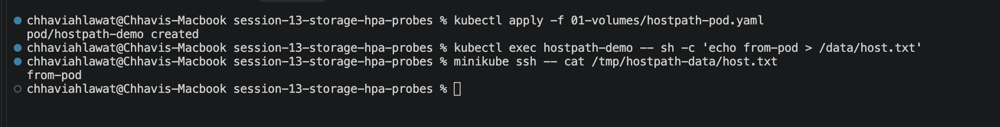
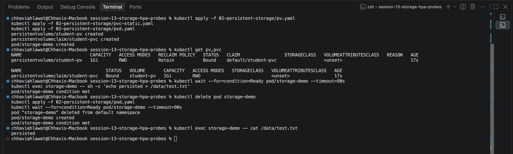
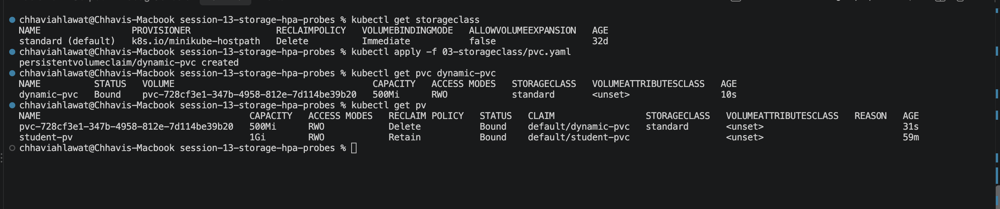

# Session 13 — Kubernetes Storage, HPA & Probes (Homework)

**Name:** Chhavi Ahlawat
**Enrollment Number:** 24BCS10201
**Email:** chhavi.24bcs10201@sst.scaler.com

---

## Homework Tasks

| Task | Description | Status |
|---|---|---|
| 1 | Volumes: emptyDir, hostPath, PV, PVC, StorageClass, dynamic provisioning | ✅ |
| 2 | HPA: deploy app, configure HPA, generate load, watch pods scale | ✅ |
| 3 | Mini project: PVC + probes + HPA in the `production-webapp` namespace | ✅ |

Volume notes: [`01-kubernetes-volumes/README.md`](01-kubernetes-volumes/README.md)

All commands are run from `session-13-storage-hpa-probes/` on minikube:
```bash
minikube start
minikube addons enable metrics-server
```

---

## 1. Volumes

### emptyDir
```bash
kubectl apply -f 01-volumes/emptydir-pod.yaml
kubectl exec emptydir-demo -- sh -c 'echo hello > /data/hello.txt && cat /data/hello.txt'
kubectl describe pod emptydir-demo | grep -A3 Volumes
```


### hostPath
```bash
kubectl apply -f 01-volumes/hostpath-pod.yaml
kubectl exec hostpath-demo -- sh -c 'echo from-pod > /data/host.txt'
minikube ssh -- cat /tmp/hostpath-data/host.txt
```


### PV + PVC (static) and data persistence
```bash
kubectl apply -f 02-persistent-storage/pv.yaml
kubectl apply -f 02-persistent-storage/pvc-static.yaml
kubectl apply -f 02-persistent-storage/pod.yaml
kubectl get pv,pvc
kubectl exec storage-demo -- sh -c 'echo persisted > /data/test.txt'
kubectl delete pod storage-demo
kubectl apply -f 02-persistent-storage/pod.yaml
kubectl wait --for=condition=Ready pod/storage-demo --timeout=90s
kubectl exec storage-demo -- cat /data/test.txt
```


`pvc-static.yaml` sets `storageClassName: ""`. Without it, minikube's default StorageClass would provision a new volume and `student-pv` would never get bound.

### StorageClass + dynamic provisioning
```bash
kubectl get storageclass
kubectl apply -f 03-storageclass/pvc.yaml
kubectl get pvc dynamic-pvc
kubectl get pv
```


---

## 2. HPA (`04-hpa/`)

Files: [`deployment.yaml`](04-hpa/deployment.yaml) (CPU request 100m), [`service.yaml`](04-hpa/service.yaml), [`hpa.yaml`](04-hpa/hpa.yaml) (1–5 replicas, 50% CPU), [`load-generator.yaml`](04-hpa/load-generator.yaml)

### Deploy and configure HPA
```bash
kubectl apply -f 04-hpa/deployment.yaml -f 04-hpa/service.yaml -f 04-hpa/hpa.yaml
kubectl get hpa hpa-demo
kubectl top pods
```


### Generate load and watch the scaling
```bash
kubectl apply -f 04-hpa/load-generator.yaml
kubectl get hpa hpa-demo -w          # Ctrl+C once REPLICAS goes up
kubectl top pods
kubectl get pods -l app=hpa-demo
```


```bash
kubectl describe hpa hpa-demo
```


After `kubectl delete pod load-generator` the HPA scales back down to 1 replica. The default stabilization window for scale-down is 5 minutes.

---

## 3. Mini Project (`mini-project/`)

### Deploy
```bash
cd mini-project
kubectl apply -f namespace.yaml
kubectl apply -f pvc.yaml -f deployment.yaml -f service.yaml -f hpa.yaml
kubectl get pvc,pods,svc,hpa -n production-webapp
```


### Storage persistence
```bash
POD=$(kubectl get pods -n production-webapp -l app=web-app -o jsonpath='{.items[0].metadata.name}')
kubectl exec -n production-webapp $POD -- sh -c 'echo "Student: Chhavi Ahlawat" > /data/student.txt'
kubectl delete pod -n production-webapp $POD
kubectl wait --for=condition=Ready pod -l app=web-app -n production-webapp --timeout=90s
NEW=$(kubectl get pods -n production-webapp -l app=web-app -o jsonpath='{.items[0].metadata.name}')
kubectl exec -n production-webapp $NEW -- cat /data/student.txt
```


### Probes + HPA scaling
```bash
kubectl describe pod -n production-webapp $NEW | grep -E 'Liveness|Readiness|Startup'
kubectl run load-generator -n production-webapp --image=busybox:1.36 --restart=Never \
  -- /bin/sh -c "while true; do wget -q -O- http://web-service > /dev/null; done"
kubectl get hpa -n production-webapp -w      # Ctrl+C once REPLICAS goes up
kubectl get pods -n production-webapp
```


---

## Cleanup
```bash
# from mini-project/
kubectl delete namespace production-webapp
cd ..
kubectl delete -f 04-hpa/load-generator.yaml -f 04-hpa/hpa.yaml -f 04-hpa/service.yaml -f 04-hpa/deployment.yaml
kubectl delete -f 03-storageclass/pvc.yaml
kubectl delete -f 02-persistent-storage/pod.yaml -f 02-persistent-storage/pvc-static.yaml -f 02-persistent-storage/pv.yaml
kubectl delete -f 01-volumes/emptydir-pod.yaml -f 01-volumes/hostpath-pod.yaml
```

---

## Resources
- https://kubernetes.io/docs/concepts/storage/volumes/
- https://kubernetes.io/docs/concepts/storage/persistent-volumes/
- https://kubernetes.io/docs/tasks/run-application/horizontal-pod-autoscale/
