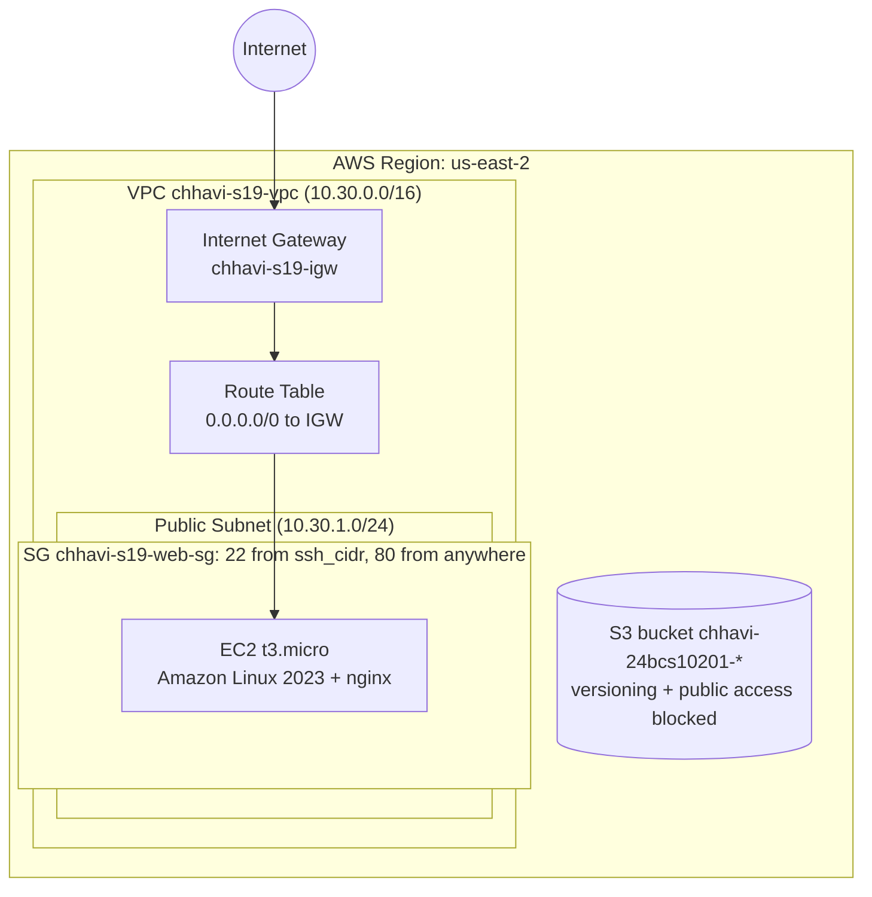

# Session 19 — Cloud & Terraform in Action (Homework)

**Name:** Chhavi Ahlawat
**Enrollment Number:** 24BCS10201
**Email:** chhavi.24bcs10201@sst.scaler.com

---

## Homework Tasks

| Task | Description | Status |
|---|---|---|
| 1 | VPC lab — VPC, subnet, IGW, route table, SG ([`06-terraform-vpc`](06-terraform-vpc/README.md#my-lab-submission)) | ✅ |
| 2 | End-to-end project — VPC + Subnet + SG + EC2 (nginx) + S3 ([`homework/`](homework/)) | ✅ |
| 3 | Architecture diagram, terraform workflow (init → plan → apply → destroy), state | ✅ |

**Region:** `us-east-2` · **Names:** `chhavi-s19-*` · **Tag:** `Owner = chhavi`

---

## Architecture



## Project Files (`homework/`)

| File | Concept |
|---|---|
| `versions.tf` | Provider (`hashicorp/aws ~> 6.0`) + `default_tags` |
| `variables.tf` | Variables: region, CIDRs, instance type, `ssh_cidr`, optional `key_name` |
| `main.tf` | Resources + data sources (latest AL2023 AMI, AZs) |
| `outputs.tf` | `vpc_id`, `subnet_id`, `sg_id`, `instance_public_ip`, `website_url`, `s3_bucket_name` |

**Dependencies**
- *Implicit:* references like `vpc_id = aws_vpc.main.id` and `subnet_id = aws_subnet.public.id` tell Terraform the order (VPC → subnet/IGW → route table → association).
- *Explicit:* `aws_instance.web` has `depends_on = [aws_route_table_association.public]` so the subnet has internet access before nginx is installed by `user_data`.

---

## 1. Init & Validate
```bash
cd homework
cp terraform.tfvars.example terraform.tfvars
terraform init
terraform fmt && terraform validate
```


## 2. Plan
```bash
terraform plan
```


## 3. Apply + Outputs
```bash
terraform apply
terraform output
```


## 4. State
```bash
terraform state list
terraform state show aws_instance.web
```


## 5. Website running on EC2
```bash
curl $(terraform output -raw website_url)
```


## 6. Resources in AWS Console


## 7. Destroy
```bash
terraform destroy
```

